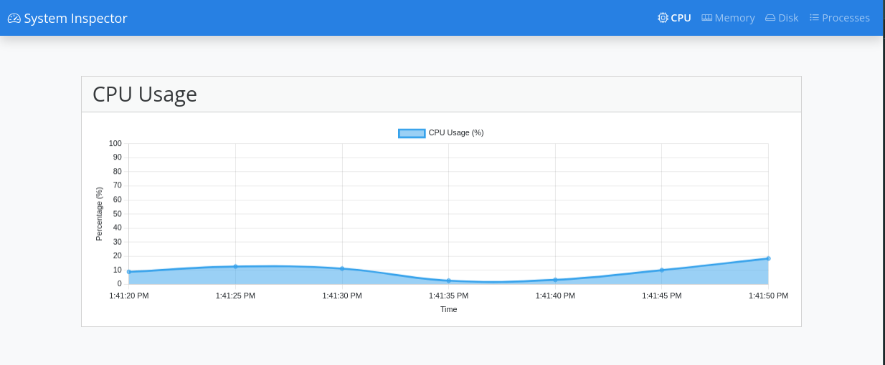
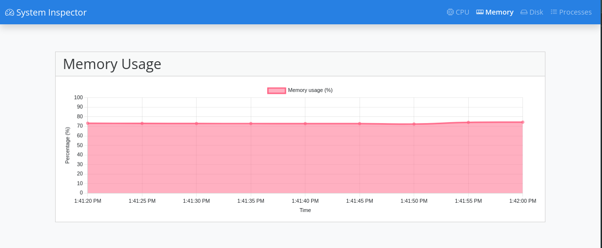
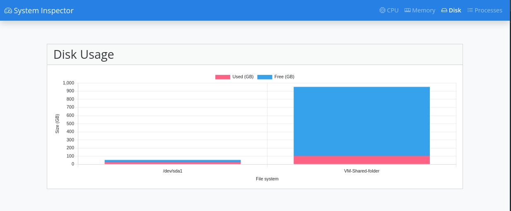
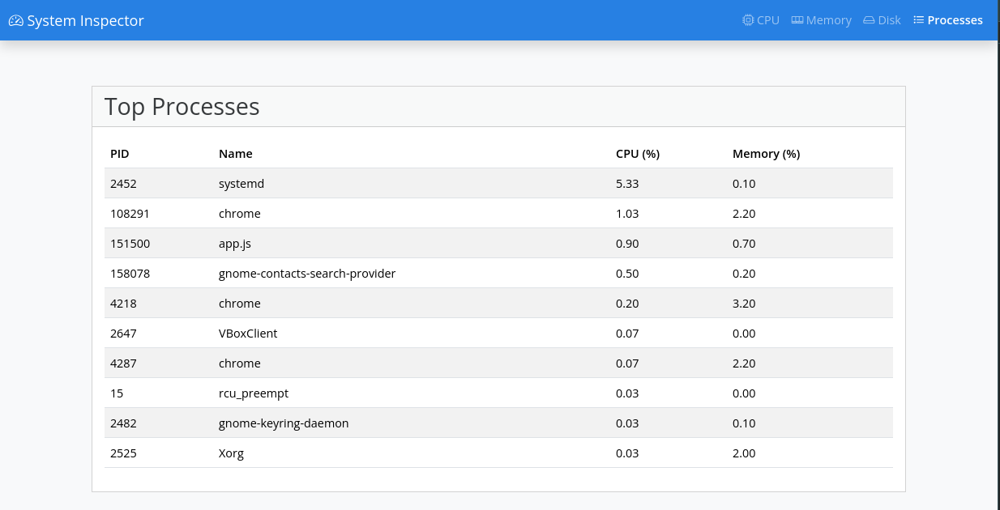

# System Inspector

System Inspector is a real-time web application that monitors system resources such as CPU usage, memory, and more. 
It is built using Fastify for high performance and systeminformation to fetch hardware and software metrics.

## Features
- **Real-time monitoring** of system resources such as CPU, memory, disk usage, and processes.
- Interactive **web-based UI** for visualizing data dynamically.
- Lightweight and fast, designed with **Fastify** and **WebSockets**.

## Prerequisites
- **Node.js** (version 16 or higher recommended)
- **npm**

## Installation

1. Clone the repository:
    ```bash
    git clone https://github.com/MatiasRicardi/system_inspector.git
    ```

2. Navigate to the project directory:
    ```bash
    cd system_inspector
    ```

3. Install dependencies:
    ```bash
    npm install
    ```

## Usage

1. Start the application:
    ```bash
    npm start
    ```

2. Open your browser and navigate to `http://localhost:3280`.

## Project Structure

- **`app.js`**: Entry point for the application, responsible for initializing Fastify and setting routes.
- **`views/`**: Contains EJS templates for rendering dynamic HTML.
- **`public/`**: Static assets such as CSS and JS
- **`images/`**: Screenshots or illustrative assets used in the documentation.
- **`package.json`**: Dependencies and scripts for the application.

## Configuration

- **Port**: By default, the application runs on port `3280`. You can modify this by setting the `PORT` environment variable.
- **Static files**: Static assets (e.g., CSS, JS) are served from the `public` directory.

## Screenshots

### Dashboard View
Below are examples of the metrics visualized:

#### CPU Usage


#### Memory Usage


#### Disk Usage


#### Top Processes


## Technologies Used
- **Fastify**: A fast web framework for Node.js that provides excellent performance and flexibility.
- **EJS**: Template engine for rendering dynamic HTML content with minimal overhead.
- **systeminformation**: Comprehensive library to gather system metrics such as CPU, memory, and disk information.
- **WebSockets**: Enables real-time updates for a seamless monitoring experience.
- **Bootstrap and Bootswatch**: Used for responsive design and styling; Bootswatch provides additional pre-designed themes for Bootstrap.
- **Google Fonts**: Enhances the visual appeal of the application by integrating modern web typography.
- **Chartjs**: A JavaScript library used to create interactive charts and visualizations for presenting data intuitively.

## Contributing

Contributions are welcome! Please open an issue or submit a pull request.

## License

This project is licensed under the **MIT License**. See the `LICENSE` file for details.

## Author

Created by Matias Ricardi.